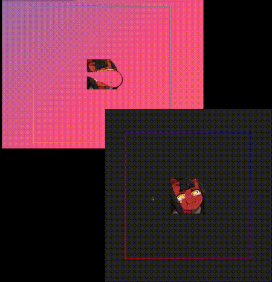

<h1 align="center">
   
  
   
  DISINTEGRATION
   
</h1>

<h4 align="center"> A simple disintegration animation on a PNG, using canvas</h4>

  <a href="#how-to-use">How To Use</a> •
  <a href="#tooling">Tooling</a> •
  <a href="#credits">Credits</a> 

## How To Use

Just hover over the image

## Tooling

- Vanilla JavaScript
- Netlify
- Vite

## Credits

-   [Franks laboratory](https://www.youtube.com/watch?v=vAJEHf92tV0)
